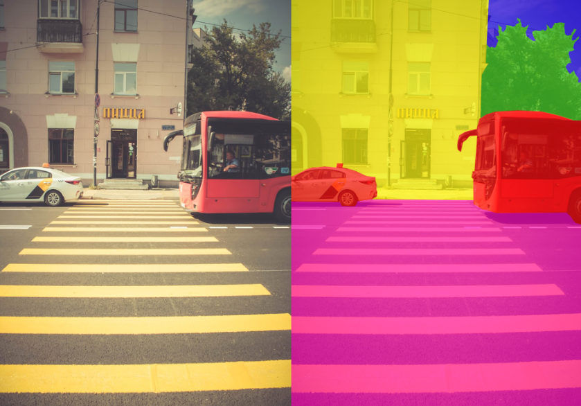

# Image segmentation
involves converting an image into a collection of regions of pixels that are represented by a mask or a labeled image.  
By dividing an image into segments, you can process only the important segments of the image instead of processing the entire image.

- Task:  
Assigning a class label to each pixel in an image, dividing the image into segments corresponding to different objects or regions.

- Output:  
A pixel-wise segmentation map where each pixel is assigned a specific class label.

- Use cases:  
  - Medical image analysis (identifying and segmenting tumors).
  - Scene understanding.
  - Robotics (environment perception).

- Algorithms:  
U-Net, FCN (Fully Convolutional Network), and Mask R-CNN are common architectures for image segmentation.

  