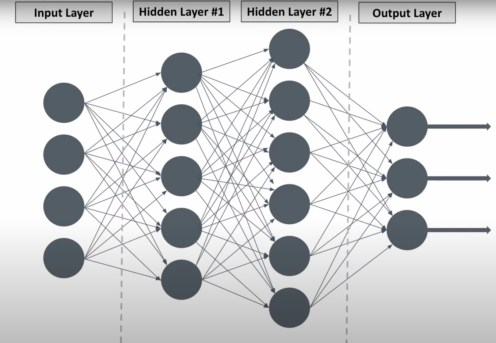

# Deep Learning
- deep learning algorithms can be regarded both as a sophisticated and **mathematically complex evolution of  
machine learning algorithms**  
- describes algorithms that analyze data with a logic structure similar to how a human would draw conclusions.  
- This can happen both through supervised and unsupervised learning.  
- To achieve this deep learning applications use a layered structure of algorithms called an **artificial neural network (ANN)**

### Artificial Neural Network (ANN)
- Hidden layers are called hidden, because their values aren’t directly observed in the training data (they are calculated during the training process).  
- In simple terms, the hidden layers are calculated values used by the network to make predictions.  
- The more hidden layers a network has, the more complex the patterns it can recognize.  
- ANNs are hungry for data. The more data you feed them, the better they perform.  

  

Advantages of deep learning:
- Automatic feature extraction (no need to manually define features)
- High accuracy
