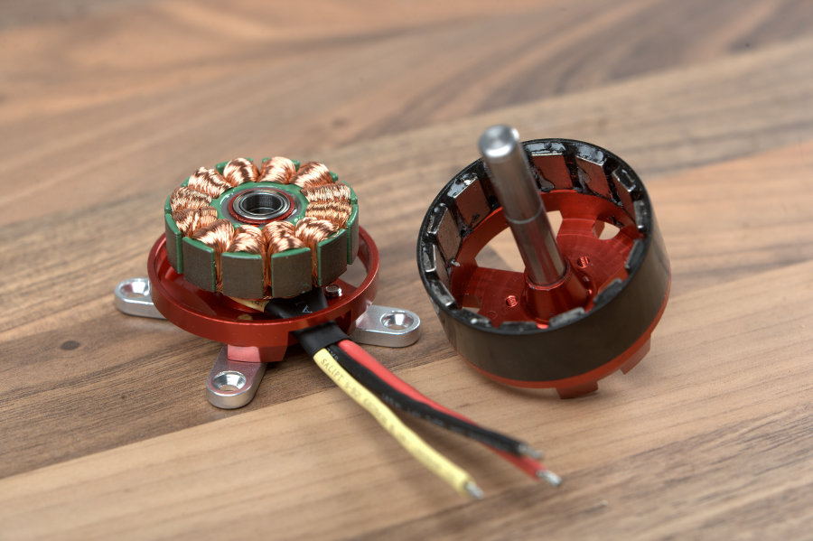

# DC motors

    
  &nbsp; &nbsp;
    

  

# Servomotors
is a motor that can be controlled to rotate to a specific angle. 
Actually it is a DC motor with a built-in feedback mechanism that controls the speed and position of the motor.

    
  &nbsp; &nbsp;
    

# BLDC motors

   
  &nbsp; &nbsp;
    

