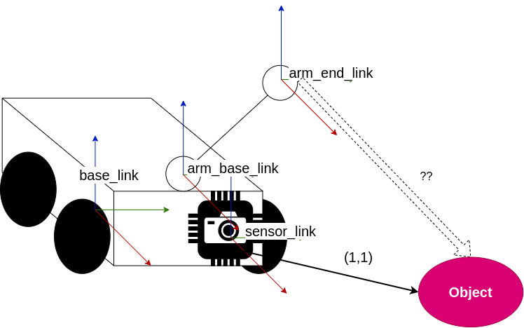

# tf2
> tf2 is the transform library, which lets the user keep track of multiple coordinate frames over time. tf2 maintains the
> relationship between coordinate frames in a tree structure buffered in time and lets the user transform points, vectors, 
> etc. between any two coordinate frames at any desired point in time.  
> Documentation: [tf2](https://docs.ros.org/en/iron/Concepts/Intermediate/About-Tf2.html?highlight=tf2)

## tf2 commands 

- `ros2 run tf2_tools view_frames.py` - generate pdf file with TF transform tree
- `ros2 run tf2_ros tf2_echo <parent frame> <child frame>` - reports the transform between any two frames broadcast over ROS