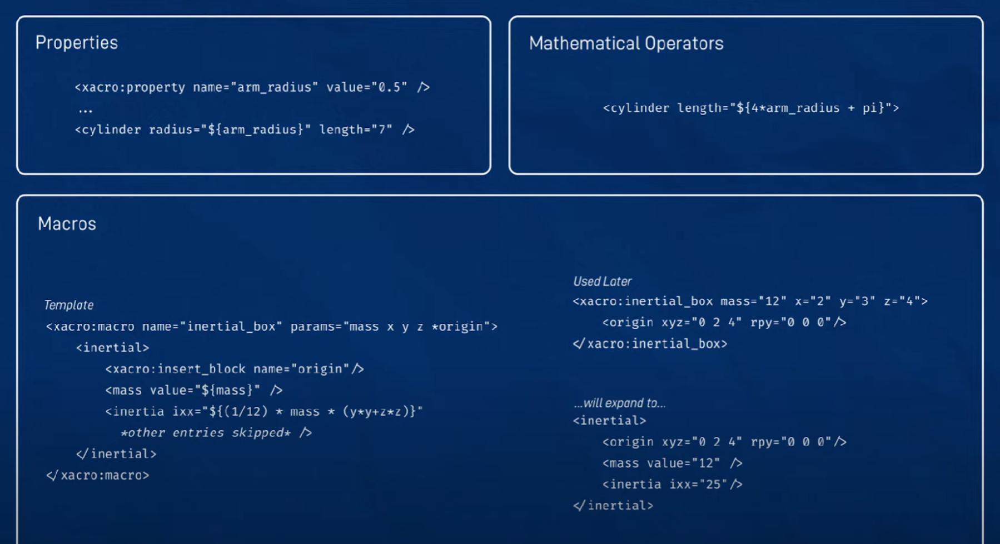

> Kinematics is the study of motion without considering the forces that cause the motion.  
> **Inverse kinematics** is the process of determining the parameters of a jointed flexible  
> object (e.g. a robot arm) necessary to place the end of the object in a given position and orientation.  
> **Forward kinematics** is the process of determining the position and orientation of the end of a jointed flexible  
> object (e.g. a robot arm) given the parameters of the joints. Inverse kinematics is more difficult  
> than forward kinematics because there are multiple possible solutions to the problem. For example, a robot arm  
> with 3 joints has 3 degrees of freedom. If the end of the arm is at a given position and orientation, there are multiple  
> possible configurations of the joints that could result in the same position and orientation of the end of the arm.  

- kinematic chain is a set of links connected by joints
- serial manipulator is a kinematic chain with a single end-effector (e.g. robot arm)

> Pose = Position + Orientation 
> Position = (x, y, z)
> Orientation = (roll, pitch, yaw)

# URDF - Unified Robot Description Format
URDF is an XML format for representing a robot model (file extension .urdf)

- link is a rigid body with inertia (urdf example: `<link name="base_link">`)
- joint is a connection between two links
- joint origin tag defines the pose of the joint relative to the parent link (urdf example: `<origin xyz="0 0 0" rpy="0 0 0"/>`)
- joint types are:
  - fixed (no movement) (e.g. between base_link and odom) (urdf example: `<joint name="base_to_odom" type="fixed">`)
  - continuous (revolute with no limits)
  - revolute (rotational) ()
  - prismatic
  - floating
  - planar
- transmission is a connection between a joint and an actuator

## XACRO - XML Macros for URDF
Files with extension .xacro are XML files that can contain macros. Macros are used to simplify the creation of URDF files.

<!--  -->
