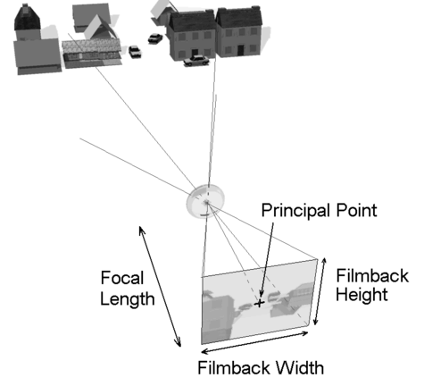
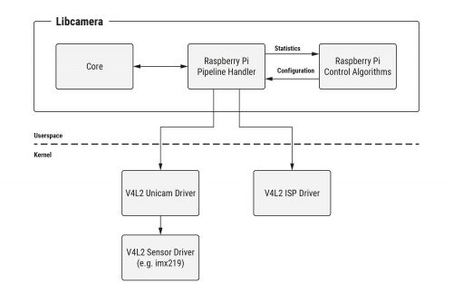

=======
Cameras
=======

Stereo cameras
==============
Stereo camera is a pair of cameras that are mounted on the same platform and have parallel optical axes. The distance between the optical axes is called
baseline. The baseline is usually measured in millimeters. The baseline is usually in the range of 50-100 mm. The baseline is usually fixed and cannot be
changed. The baseline is usually measured from the center of the camera lenses.

Stereo cameras are used to capture 3D information about the scene.

.. figure:: images/stereo_camera_zed.png
   :alt: Stereo camera
   :width: 500px

.. figure:: images/parallax.png
   :alt: Stereo camera setup
   :width: 400px
   
   `Source <https://www.researchgate.net/figure/Principle-drawing-of-a-stereo-camera-setup-Objects-1-2-in-various-depth-ranges-are_fig5_303307354>`_

Objects (1,2) in various depth ranges are captured from different camera views. The displacement of the object position from left to right stereo image 
is called **parallax** and depends on the object's distance.

To find distance to the object we need to know the baseline and the parallax. The baseline is fixed and known. The parallax can be measured from the
stereo image. The parallax is measured in pixels. The parallax is inversely proportional to the distance to the object. **The closer the object the larger
the parallax**. 

Camera parameters
=================

   
   `Source <https://download.autodesk.com/us/maya/mayamatchmoveronlinehelp/index.html?url=WS1a9193826455f5ff-e569a012180ce5891-548a.htm,topicNumber=d0e2765>`_

Camera calibration
==================
Camera calibration is the process of estimating a camera's intrinsic and extrinsic parameters to correct distortions and ensure accurate measurements
in computer vision tasks. It involves determining factors such as Focal Length, Principal Point, and lens distortion coefficients.
To calibrate a camera, we need to take pictures of a calibration pattern from different angles and orientations.

* The **intrinsic parameters** deal with the camera's internal characteristics, such as, principal point, focal length, distortion  
* The **extrinsic parameters** deal with the camera's position and orientation in the world (rotation matrix and translation vector)

**Lens distortion** is caused by the lens of the camera. It causes straight lines to appear curved.

.. figure:: images/lens_distortion.png
   :alt: Lens distortion

.. _intel_realsense:
Intel RealSense depth cameras (RGBD)
====================================
The Intel RealSense Depth Camera D400-Series uses stereo vision to calculate depth. 

`Official website <https://www.intelrealsense.com/>`_

**Intel RealSense SDK 2.0** (librealsense) is a cross-platform library for Intel RealSense depth cameras (D400 & L500 series and the SR300).
The SDK allows depth and color streaming, and provides intrinsic and extrinsic calibration information. 
The library also offers synthetic streams (pointcloud, depth aligned to color and vise-versa), 
and a built-in support for record and playback of streaming sessions.

* `Intel RealSense on GitHub <https://github.com/IntelRealSense/librealsense>`_
* `ROS wrapper for Intel RealSense on GitHub <https://github.com/IntelRealSense/realsense-ros>`_

UVC (USB Video Class)
=====================
UVC cameras (USB video class) are USB-powered devices that incorporate a standard video streaming functionality – 
connecting seamlessly with the host machines.

UVC is supported by the Linux kernel and is natively available in most Linux distributions.

V4L
===
Video4Linux, V4L for short, is a collection of device drivers and an API for supporting realtime video capture on Linux systems.

V4L2 (Video4Linux2) is the second version of V4L.

Video4Linux2 is responsible for creating V4L2 device nodes aka a device file (/dev/videoX, /dev/vbiX and /dev/radioX) 
and tracking data from these nodes

* ``v4l2-ctl`` is a V4L2 utility that can be used to configure video for Linux devices (installed as part of the ``v4l-utils`` package)

  - ``v4l2-ctl --list-devices`` lists the available video devices. 
  - ``v4l2-ctl --all`` lists all the controls for the video device.
  - ``v4l2-ctl --device=/dev/video0 --list-formats-ext`` lists the available video formats for the video device.
  - ``v4l2-ctl --device=/dev/video0 --set-fmt-video=width=1920,height=1080 --verbose`` sets resolution and pixel format for the video device.
  - ``v4l2-ctl --device=/dev/video0 --set-ctrl=focus_auto=0`` disables autofocus
  - ``v4l2-ctl --device=/dev/video0 --set-ctrl=focus_absolute=<value>`` sets manual focus (value typically 0-255)

Libcamera
=========
Libcamera is a cross-platform camera support library that provides a generic way to access and control camera devices.
Libcamera is designed to be a camera stack that is agnostic to the underlying hardware and supports multiple camera devices.
Comparing to V4L2, libcamera provides a higher level of abstraction and a more consistent API across different camera devices.

   `Source <https://www.raspberrypi.com/news/an-open-source-camera-stack-for-raspberry-pi-using-libcamera/>`_

FFmpeg
======
FFmpeg is the leading multimedia framework, able to decode, encode, transcode, mux, demux, 
stream, filter and play pretty much anything that humans and machines have created.

`Official Website <https://ffmpeg.org/>`_

Codecs
------

* ``libx264`` is a free software library and application for encoding video streams into the H.264/MPEG-4 AVC format.

* ``h264_v4l2m2m`` is hardware accelerated H.264 encoder using V4L2 mem2mem API (for example, on Raspberry Pi)

* ``h264_nvenc`` is NVIDIA GPU hardware accelerated H.264 encoder (nvenc means NVIDIA encoder)

* ``libvpx-vp9`` is a free software video codec developed by Google (VP9 codec). It is part of the WebM project.
  It is widely used in WebRTC and YouTube. Comparing to H.264, VP9 provides better compression and quality at the same bitrate.

Commands
--------

* ``ffmpeg`` is a command-line tool that can be used to capture, convert, and stream audio and video

  - ``ffmpeg -f v4l2 -i /dev/video0 -c:v libx264 -f flv rtmp://localhost/live/stream`` captures video from the V4L2 device (camera), 
    encodes it using libx264 codec, and streams it to the RTMP server

  - ``ffmpeg -codecs`` lists all the codecs supported by FFmpeg

  - ``ffmpeg -h encoder=libx264`` lists the options for the libx264 encoder

* ``ffplay`` is a simple media player based on SDL and the FFmpeg libraries
  
  - ``ffplay -f v4l2 -i /dev/video0`` plays the video stream from the V4L2 device

  - ``ffplay video.mp4`` plays the video file

  - ``ffplay rtmp://localhost/live/stream`` plays the video stream from the RTMP server

  - ``ffplay -fflags nobuffer rtmp://localhost:1935/live/1234`` plays the video stream from the RTMP server with no buffering (for low latency)

* ``ffprobe`` is a command-line tool that shows information (like codecs, bitrates, ...) about multimedia streams 

  - ``ffprobe video.mp4`` provides information about the video file

  - ``ffprobe /dev/video0`` provides information about the V4L2 device

GStreamer
=========
GStreamer is a pipeline-based multimedia framework that links together a wide variety of media processing systems to complete complex workflows.
GStreamer is a framework for creating streaming media applications.
For instance, GStreamer can be used to build a system that reads files in one format, processes them, and exports them in another.

`Official Website <https://gstreamer.freedesktop.org/>`_

.. note::

   GStreamer provides a more flexible and modular approach to multimedia processing. It allows developers to easily create custom pipelines and 
   plug-in their own components. FFMPEG, on the other hand, focuses more on providing pre-built solutions and may have limited 
   flexibility in terms of customization.

How to use CSI camera with Nvidia Jetson
========================================

1. Install ``v4l-utils`` for working with V4L2 devices and ``v4l2loopback-dkms`` for creating virtual video devices

2. Load the v4l2loopback module: ``sudo modprobe v4l2loopback devices=1`` which creates a virtual video device

3. Stream the video frm the CSI camera (nvarguscamerasrc) to the virtual video device: 
   ``gst-launch-1.0 nvarguscamerasrc timeout=31536000 ! 'video/x-raw(memory:NVMM),width=1280,height=720,framerate=30/1' ! nvvidconv ! 'video/x-raw,format=I420' ! queue ! videoconvert ! 'video/x-raw,format=YUY2' ! queue ! v4l2sink device=/dev/video1``

4. View the video stream from the virtual video device: ``ffplay /dev/video1``

.. note::
   If the GStreamer pipeline fails, try to restart the nvargus service: ``sudo systemctl restart nvargus-daemon.service``

Useful Resources
================

* `List of 3D Sensors (depth cameras) for robotics applications <https://rosindustrial.org/3d-camera-survey>`_

