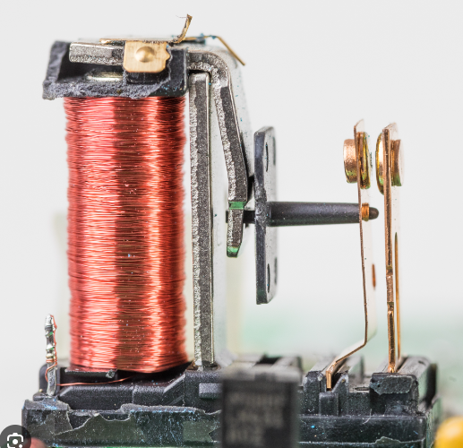
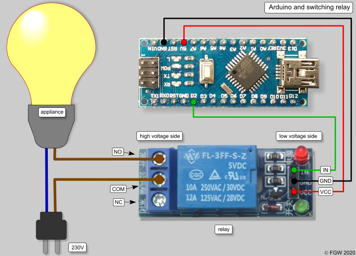

======
Relays
======
A relay is an electrically operated switch.  It consists of a set of input terminals for a single or multiple control signals, 
and a set of operating contact terminals.

   Electrical relay

.. figure:: ../images/electrical_relay_principle.gif    
   :width: 400px
   :alt: Working principle of electrical relay
  
   Working principle of electrical relay. `Source <https://instrumentationtools.com/relay-principle-its-types/?utm_content=cmp-true>`_

  
   Arduino controlling a relay. `Source <https://thesolaruniverse.wordpress.com/2020/10/12/arduino-combined-with-a-switching-relay/>`_
