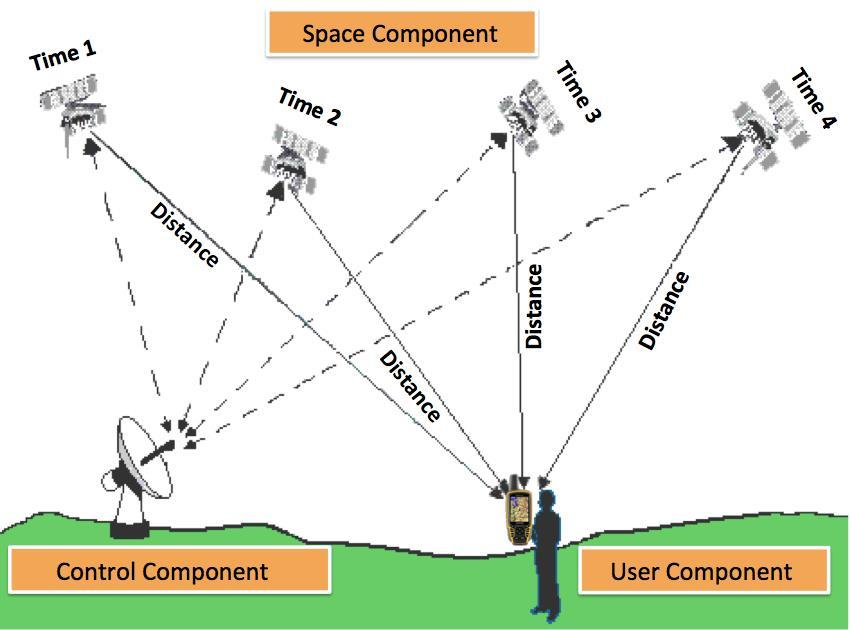

===
GPS
===

GPS (Global Positioning System) is a satellite-based navigation system that provides location and time information 
anywhere on or near the Earth where there is an unobstructed line of sight to four or more GPS satellites. 
The system is operated by the United States government and is freely accessible to anyone with a GPS receiver.

**GPS works by using a network of satellites that orbit the Earth**

#. These satellites continuously transmit signals that contain the satellite's position and the precise time the signal was transmitted. 

#. A GPS receiver on the ground or in a vehicle picks up these signals from multiple satellites and uses the timing information to calculate 
   its distance from each satellite based on the time it took for the signals to arrive. 
  
#. By combining distance measurements from multiple satellites, the GPS receiver can determine its own three-dimensional position (latitude, longitude, and altitude) 
   as well as the precise time.

It has become an essential tool for navigation, mapping, tracking, and timing synchronization in many industries and everyday activities.

**Compoments of GPS**

1. Satellites – They serve like stars in the constellation.
2. Ground stations – They monitor and control satellites. Ground stations also identify their location.
3. Receivers – Receivers are constantly listening for signals from the satellites. Highly advanced receivers can even identify the exact location within a fraction of an inch.

   
   `Source <https://trakkitgps.com/how-gps-works/>`_

NMEA
====
NMEA is an acronym for the National Marine Electronics Association. NMEA existed well before GPS was invented. 
According to the NMEA website, the association was formed in 1957 by a group of electronic dealers to create better 
communications with manufacturers. 

Today in the world of GPS, NMEA is a standard data format supported by all GPS manufacturers, much like ASCII is the standard 
for digital computer characters in the computer world.

Example of NMEA sentence (standardized data string). Here is popular NMEA sentence GGA (there exist different types of NMEA sentences):

.. code-block:: bash

  $GPGGA,123519,4807.038,N,01131.000,E,1,08,0.9,545.4,M,46.9,M,,*47

Where:

- **GP**           GPS position (GL would denote GLONASS). GGA is the NMEA sentence for GPS Fix Data.
- **123519**       is the time stamp: UTC time in hours, minutes and seconds.
- **4807.038,N**   Latitude 48 deg 07.038' N
- **01131.000,E**  Longitude 11 deg 31.000' E
- **1**            Quality Indicator (1 = GPS fix, or  uncorrected coordinate)                          
- **08**           Number of satellites being tracked
- **0.9**          Horizontal dilution of position (poition accuracy, the lower the better [<1 is Ideal])
- **545.4**        Altitude above mean sea level
- **M**            Units of altitude (Meters)
- **46.9**         Height of geoid (mean sea level) above WGS84 ellipsoid
- **M**            Units of geoidal height (Meters)
- (empty field) time in seconds since last DGPS update
- (empty field) DGPS station ID number
- ***47**          the checksum data, always begins with *  
      

