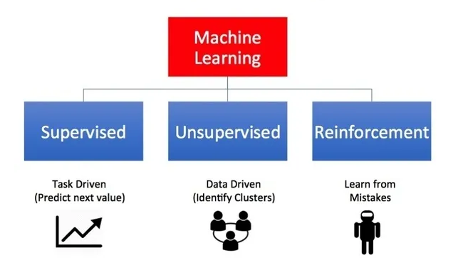
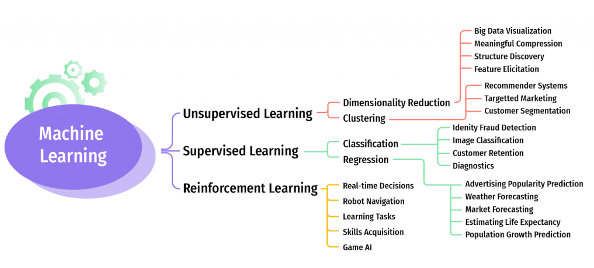
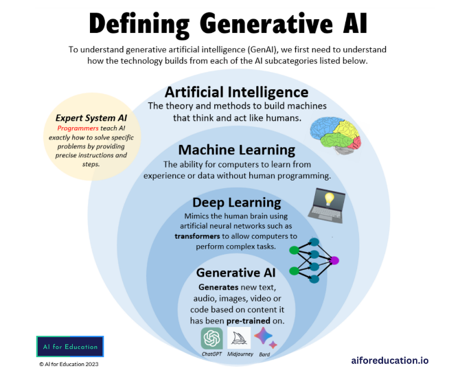

======================
AI/ML and Data Science
======================

Machine Learning
================
Machine learning means that a computer program improves through experience; it does not need a programmer 
to alter the program for it to improve. The computer tests a way to complete a task, measures its success, 
and then changes its approach and tests it again, and again. It always tries to improve on its measurement of success.

.. image:: images/ml_vs_trad_programming.jpg 
   :width: 450px
   :alt: Machine Learning vs Traditional Programming

   
   Types of Machine Learning. `Source. <https://towardsdatascience.com/machine-learning-for-beginners-d247a9420dab>`_

   
Types of Machine Learning. `Source. <https://idapgroup.com/blog/types-of-machine-learning-out-there/>`_

.. toctree::
   :maxdepth: 2

   model
   deep_learning
   computer_vision/computer_vision
   finite_state_machine
   rl