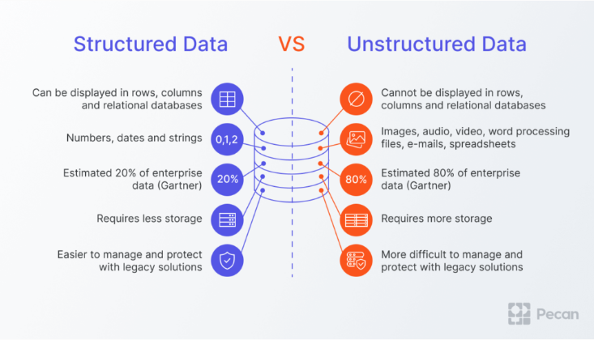

=====================
Data and Data Science
=====================
Data science is an interdisciplinary academic field that uses statistics, scientific computing, scientific methods, processes, 
algorithms and systems to extract or extrapolate knowledge and insights from potentially noisy, structured, or unstructured data.

   
   Structured vs Unstructured Data. `Source. <https://www.pecan.ai/blog/what-is-structured-data/>`_

Dataset
=======
Dataset is a collection of data that is used to train a machine learning model. The dataset is usually split into two parts:  
training and testing. The training dataset is used to train the model, while the testing dataset is used to evaluate  
the model's performance.

.. tip::
   Origin of word "dataset": Latin data (things given) + set (group of things).

**ImageNet** is a dataset of over 15 million labeled high-resolution images belonging to roughly 22,000 categories. 
The images were collected from the web and labeled by human labelers using Amazon’s Mechanical Turk crowd-sourcing tool. 

Starting in 2010, as part of the Pascal Visual Object Challenge, an annual competition called the ImageNet Large-Scale 
Visual Recognition Challenge (ILSVRC) has been held. ILSVRC uses a subset of ImageNet with roughly 1000 images in each of 1000 categories. 
In all, there are roughly 1.2 million training images, 50,000 validation images, and 150,000 testing images. 

ImageNet consists of variable-resolution images. Therefore, the images have been down-sampled to a fixed resolution of 256 x 256. 
Given a rectangular image, the image is rescaled and cropped out the central 256 x 256 patch from the resulting image.

Embeddings
==========
Embeddings are a type of data representation that can be used to represent categorical data in a continuous vector space.
Embeddings are representations of values or objects like text, images, and audio that are designed to be consumed by machine learning 
models and semantic search algorithms. These vectors capture the semantic relationships between the objects, allowing similar objects 
to be closer to each other in this space.

Essentially, embeddings enable machine learning models to find similar objects. Given a photo or a document, a machine learning model that 
uses embeddings could find a similar photo or document.

For example we would expect the distance between the word *cat* and the word *dog* to be smaller than the distance between 
the word *cat* and the word *helicopter*.

Vector Database
===============
A vector database is a database that stores embeddings. It is used to store and retrieve embeddings for similarity search.

.. figure:: images/vector_db.png
   :width: 450px
   :alt: Vector Database
   
   Vector Database. `Source. <https://www.linkedin.com/pulse/complete-guide-creating-storing-vector-embeddings-pavan-belagatti-5fyfc/>`_

Useful resources
================

* `PandasAI <https://pandas-ai.com/>`_ - PandasAI is a Python library that makes it easy to ask questions to your data in natural language.
  PandasAI uses a generative AI model to understand and interpret natural language queries and translate them into python code and SQL queries. 

* `Kaggle <https://www.kaggle.com/>`_ - is the world's largest data science community. Here you can find datasets, notebooks, and competitions.