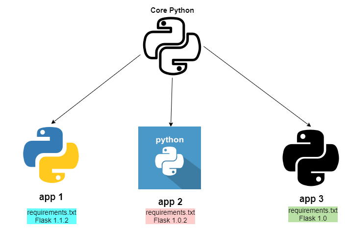

======
Python
======
Python is a high-level, general-purpose programming language. Its design philosophy emphasizes code readability  
with the use of significant indentation. Python is dynamically typed and garbage-collected. It supports multiple  
programming paradigms, including structured, object-oriented and functional programming.

* `Python tutorials <https://pythongeeks.org/>`_  
* `Official Python website <https://www.python.org/>`_

Packages and modules
====================
A module is a file containing Python definitions and statements. The file name is the module name with the suffix .py appended.
A package is a collection of Python modules: while a module is a single Python file, a package is a directory of Python modules

.. figure:: images/structure_of_python_package.png
   :alt: Structure of Python package

   Structure of Python package. Source: `Python Geeks <https://pythongeeks.org/python-packages/>`_

PIP
===
PIP is a package manager for Python packages, or modules if you like. It is used to install and manage software packages written in Python.
You can install, uninstall and upgrade packages with the help of ``pip`` command. It also helps to manage dependency between packages.

* ``pip --version`` - check pip version
* ``pip list`` - list installed packages
* ``py -m pip install --upgrade pip`` - upgrade pip
* ``pip freeze > requirements.txt`` - save all installed packages in requirements.txt file
* ``pip install -r requirements.txt`` - install all packages from requirements.txt file ``-r`` stands for requirements
* ``py -m pip install <package_name>`` - install package (it is the same as ``pip install <package_name>``)

Virtual environment
===================
Virtual environment is a tool that helps to keep dependencies required by different projects separate by creating isolated 
Python virtual environments for them.

Virtual environment can be created by using ``venv`` module. To create a virtual environment, decide upon a directory where you want 
to place it, and run the venv module as a script with the directory path: ``python3 -m venv tutorial-env``. This will create the 
``tutorial-env`` directory. So virtual environment is a self-contained directory tree that contains a Python installation for a particular version 
of Python, plus a number of additional packages.

Commands to work with virtual environment:

* ``python3 -m venv tutorial-env`` - create virtual environment
* ``source tutorial-env/bin/activate`` - activate virtual environment on Unix or MacOS
* ``tutorial-env\Scripts\activate`` - activate virtual environment on Windows
* ``deactivate`` - to deactivate virtual environment

Juoypyter Notebook
==================
Jupyter Notebook is an open-source web application that allows you to create and share documents that contain 
live code, equations, visualizations and narrative text.

`Official website <https://jupyter.org/>`_

Table of contents
=================

.. toctree::
   :maxdepth: 2

   iterables