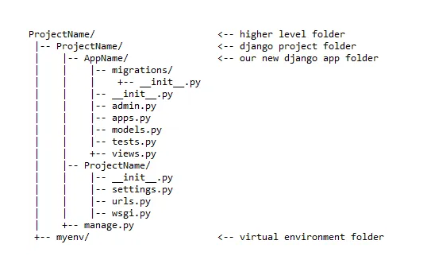

======
Django
======
Django is a free and open-source, Python-based web framework that follows the Model-View-Template (MVT) architectural pattern.

.. tip::
   Django is named after Django Reinhardt, a jazz manouche guitarist from the 1930s to early 1950s.

* `Official website <https://www.djangoproject.com/>`_
* `Django documentation <https://docs.djangoproject.com/en/5.0/>`_
* `Django Packages (directory of reusable apps, sites, tools, and more) <https://djangopackages.org/>`_
* `Tutorial: Writing your first Django app <https://docs.djangoproject.com/en/5.0/intro/tutorial01/>`_
* `“How-to” guides <https://docs.djangoproject.com/en/5.0/howto/>`_

Installation
============

1. Install Python 3.6 or higher (e.g ``sudo apt-get install python3.6`` or on Windows `download <https://www.python.org/downloads/windows/>`_ and install)

.. note::
   It is recommended to install Django in a virtual environment:

   #. ``py -m venv project-name-env`` - create a virtual environment 
   #. Linux: ``project-name-env/bin/activate``, Windows: ``project-name-env\Scripts\activate`` - activate the virtual environment

2. Install Django (e.g. ``py -m pip install Django``)
3. Verify your Django installation by executing ``django-admin --version`` in the command prompt.

Control flow in MVT architecture
================================

.. figure:: images/control_flow_in_mvt.png
   :alt: Control flow in MVT architecture
   
   Django MVT. `Source <https://www.educative.io/answers/what-is-mvt-structure-in-django>`_

#. The user interacts with a Django application using a URL that is passed to the MVT architecture. A URL mapper is used to redirect the requests to the appropriate view based on the request URL.
#. If an appropriate view is found, it will be invoked.
#. The View will interact with the Model and retrieve the necessary data from the database via Model.
#. The View will render an appropriate template along with the retrieved data to the user.

Model
======
A model is the single, definitive source of information about your data. It contains the essential fields and behaviors of the data you’re storing. 
Django follows the **DRY (Don’t repeat yourself) Principle**. The goal is to define your data model in one place and automatically derive things from it.

This includes the migrations - unlike in Ruby On Rails, for example, migrations are entirely derived from your models file, and are essentially a  
history that Django can roll through to update your database schema to match your current models.

* `Documentation <https://docs.djangoproject.com/en/5.0/topics/db/models/>`_
* `Model field reference <https://docs.djangoproject.com/en/5.0/ref/models/fields/>`_

View
====
A view is a “type” of web page in your Django application that generally serves a specific function and has a specific template.

For example, in a blog application, you might have the following views:

* Blog homepage - displays the latest few entries.
* Entry “detail” page - permalink page for a single entry.
* Year-based archive page – displays all months with entries in the given year.

A View is a handler function that accepts HTTP requests (HttpRequest object), processes them, and returns the HTTP response (HttpResponse object). 
It retrieves the necessary data to fulfill the request using Models and renders them on the user interface using Templates.
It can also create an HTML page using an HTML template dynamically, and populate it with data fetched from the model.

* `Documentation <https://docs.djangoproject.com/en/5.0/topics/http/views/>`_
* `Handling HTTP requests <https://docs.djangoproject.com/en/5.0/topics/http/>`_

Template
========
A Template is a text file that defines the structure or layout of the user interface. The text file can be any type of file; for example HTML, XML, etc.  
It can accept data from the view and render it using `jinja <https://jinja.palletsprojects.com/en/3.1.x/>`_ syntax.

* `Template guide <https://docs.djangoproject.com/en/5.0/topics/templates/>`_  
* `Built-in template tags and filters <https://docs.djangoproject.com/en/5.0/ref/templates/builtins/#ref-templates-builtins-tags/>`_

Django folder structure
=====================

   
   Django File Structure. `Source <https://medium.com/@sravyalavu503/django-create-app-e17239a6df70>`_

Files in a Django project folder:

* settings.py - contains the settings for this Django project (e.g. ``INSTALLED_APPS = ['polls.apps.PollsConfig',]``)
* urls.py - contains the URL declarations for this Django project (e.g. ``path('polls/', include('polls.urls')),``)
* manage.py - a command-line utility that lets you interact with this Django project in various ways (e.g. ``py manage.py runserver``)

Files and folders in app folder (project subfolder):

* admin.py - contains the admin site configuration (e.g. ``admin.site.register(Question)``)
* apps.py - contains the app configuration (e.g. ``class PollsConfig(AppConfig):``)
* models.py - contains the essential fields and behaviors of the data you’re storing (e.g. ``class Question(models.Model):``)
* views.py - contains the request handling logic (e.g. ``def index(request):``)
* urls.py - contains the URL declarations for this Django app (e.g. ``path('', views.index, name='index'),``)
* tests.py - contains the tests (e.g. ``class QuestionModelTests(TestCase):``)
* forms.py - contains form classes that are used to create HTML forms to be rendered in templates (e.g. ``class NameForm(forms.Form):``)
* migrations - folder that contains the database migrations (e.g. ``0001_initial.py``)
* templates - folder that contains the HTML templates (e.g. ``index.html``)

Project vs App
==============
An app is a web application that does something – e.g., a blog system, a database of public records or a small poll app. 
A project is a collection of configuration and apps for a particular website. A project can contain multiple apps. An app can be in multiple projects.

.. tip::
   Django apps are “pluggable”: You can use an app in multiple projects, and you can distribute apps, because they don’t have to be tied to a given Django installation.

   To include the app in our project, we need to add a reference to its configuration class in the INSTALLED_APPS setting

Django сommands
===============

* ``django-admin startproject <project_name>`` - create a new project
  
* ``python manage.py runserver`` - run the web server (default port is 8000) to acceess it go to ``http://localhost:8000``

* ``py manage.py startapp <app_name>`` - create a new app (app is a part of a project)

* ``py manage.py migrate`` - look at the INSTALLED_APPS setting and create any necessary database tables according to the database settings in your mysite/settings.py  
  file and the database migrations shipped with the app. So it actually modifies your database structure in the database.

* ``py manage.py makemigrations`` - you’re telling Django that you’ve made some changes to your models and that you’d like the changes to be stored as a migration.  
  **Migrations** are how Django stores changes to your models (and thus your database schema) - they’re files on disk (e.g. polls/migrations/0001_initial.py)

* ``py manage.py migrate`` - takes all the migrations that haven’t been applied (Django tracks which ones are applied using a special table in your database 
  called django_migrations) and runs them against your database - essentially, synchronizing the changes you made to your models with the schema in the database.

* ``py manage.py sqlmigrate <app_name> <migration_name>`` - displays the SQL statements for a migration (e.g. ``py manage.py sqlmigrate polls 0001``)  
  The sqlmigrate command doesn’t actually run the migration on your database - instead, it prints it to the screen so that you can see what SQL Django 
  thinks is required. It’s useful for checking what Django is going to do or if you have database administrators who require SQL scripts for changes.

* ``py manage.py check`` - run a system check to inspect the entire Django project for common problems.

* ``py manage.py shell`` - run the Python interactive interpreter, with Django already imported. It allows for executing arbitrary Python code for the purpose of 
  debugging, introspection, or testing Django code.

* ``py manage.py test <app_name>`` - run the tests for the specified app(s). By default, this will run all the test cases in all the test files of the specified app(s).

To create new app and add it to the project
-------------------------------------------

#. ``py manage.py startapp <app_name>`` - create a new app (e.g. polls)
#. Create a URLconf in the app directory (e.g. polls/urls.py)
#. Add a path() to polls/urls.py (e.g. ``path('', views.index, name='index'),``)
#. Add path to the project urls.py (e.g. ``path('polls/', include('polls.urls')),``)
#. Add app_name to the app urls.py (e.g. ``app_name = 'polls'``) this is optional but it allows to use namespaces in templates
#. Add the app to the INSTALLED_APPS setting in the project settings.py file (e.g. ``'polls.apps.PollsConfig',``) 
#. Create migration (``py manage.py makemigrations``)
#. Apply migration (``py manage.py migrate``)

3 steps to make a model change
------------------------------

#. Change your models (in models.py).
#. Run ``py manage.py makemigrations`` to create migrations for those changes
#. Run ``py manage.py migrate`` to apply those changes to the database.

Databse API
===========

`Django Database API <https://docs.djangoproject.com/en/5.0/topics/db/queries/>`_

* ``<ModelName>.objects.all()`` - returns ``QuerySet`` of all objects in the database (e.g. ``Question.objects.all()``) (``SELECT * FROM Question``)

* ``QuerySet`` - is a class that allows you to filter, order or limit the results returned from the database. It is a lazy operation, 
  so you can chain filters together and Django won't actually run the query until the results are needed.

* ``<ModelName>.objects.get(<field_name>=<value>)`` - returns a single object matching the given keyword arguments (e.g. ``Question.objects.get(id=1)``)
  (``SELECT * FROM Question WHERE id=1``)

* ``print(<QuerySet>.query)`` - print the SQL query that will be executed by the QuerySet (e.g. ``print(Question.objects.all().query)``)

Django shortcut functions
=========================
shortcut functions are just a convenient wrapper around creating a ``HttpResponse`` object with the given content and ``content_type`` argument.
Usually called from within views.

`Shortcut functions <https://docs.djangoproject.com/en/5.0/topics/http/shortcuts/>`_

* ``get_object_or_404`` - is a shortcut function that allows you to get an object from the database based on a primary key or slug. 
  If the object doesn't exist, it will return a 404 error as ``Http404`` exception.

* ``render()`` - returns a ``HttpResponse`` object with the given template rendered with the given context.
  E.g. ``return render(request, 'polls/index.html', context)``.

django.urls utility functions
=============================
are used to manipulate urls.

`URL utility functions <https://docs.djangoproject.com/en/5.0/ref/urlresolvers/>`_

* ``reverse()`` - allows retrieving url details from the url's.py file through the name value provided.
  E.g. ``return HttpResponseRedirect(reverse("polls:results", args=(question.id,)))``

Request and response objects
============================
Django uses request and response objects to pass state through the system.

When a page is requested, Django creates an HttpRequest object that contains metadata about the request. Then Django loads the appropriate view, 
passing the HttpRequest as the first argument to the view function. Each view is responsible for returning an HttpResponse object.

`Request and response objects <https://docs.djangoproject.com/en/5.0/ref/request-response/#django.http.HttpRequest.POST/>`_

Class-based views
=================
Class-based views provide an alternative way to implement views as Python objects instead of functions. They do not replace function-based views, 
but have certain differences and advantages when compared to function-based views:

* Organization of code related to specific HTTP methods (GET, POST, etc.) can be addressed by separate methods instead of conditional branching.
* Object oriented techniques such as mixins (multiple inheritance) can be used to factor code into reusable components.

`Class-based views <https://docs.djangoproject.com/en/5.0/topics/class-based-views/>`_

Forms
=====
* `Working with forms <https://docs.djangoproject.com/en/5.0/topics/forms/>`_
* `Creating forms from models <https://docs.djangoproject.com/en/5.0/topics/forms/modelforms/>`_
* `The Forms API <https://docs.djangoproject.com/en/5.0/ref/forms/api/>`_

Form fields
-----------
A form’s fields are themselves classes; they manage form data and perform validation when a form is submitted. A *DateField* and a 
*FileField* handle very different kinds of data and have to do different things with it.

`Form fields <https://docs.djangoproject.com/en/5.0/ref/forms/fields/>`_

Widgets
-------
A widget is Django’s representation of an HTML input element. The widget handles the rendering of the HTML, and the extraction of data from 
a GET/POST dictionary that corresponds to the widget.

Each form field has a corresponding Widget class, which in turn corresponds to an HTML form widget such as <input type="text">
In most cases, the field will have a sensible default widget. For example, by default, a *CharField will have a TextInput widget*, 
that produces an <input type="text">

`Widgets <https://docs.djangoproject.com/en/5.0/ref/forms/widgets/>`_

Testing
=======
Django’s unit tests use a Python standard library module: ``unittest``. This module defines tests using a class-based approach.
Unit tests are written in the tests.py file in each application directory. To run tests execute ``py manage.py test <app_name>``

`Testing in Django <https://docs.djangoproject.com/en/5.0/topics/testing/>`_

* ``TestCase`` - is a class that inherits from ``unittest.TestCase``. It provides methods that help you test different conditions for your code. 
  E.g. ``class QuestionModelTests(TestCase):``

Admin site
==========	
Admin site is a built-in app that Django provides for administrative activities. It can be used to create, view, update and delete records.

Creating an admin user

#. Run ``py manage.py createsuperuser`` and enter the username, email and password for the admin user.
#. ``python manage.py runserver`` - start the development server
#. Open in a web browser ``http://localhost:8000/admin`` and enter the username and password to login to the admin site.

Python WSGI Applications
========================

.. figure:: images/wsgi.jpg
   :alt: Python WSGI Application
   
   Python WSGI Applications. `Source <https://dev.to/afrazkhan/python-wsgi-applications-1kjb>`_