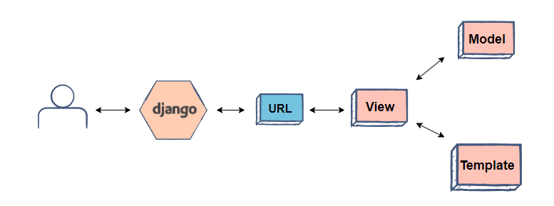
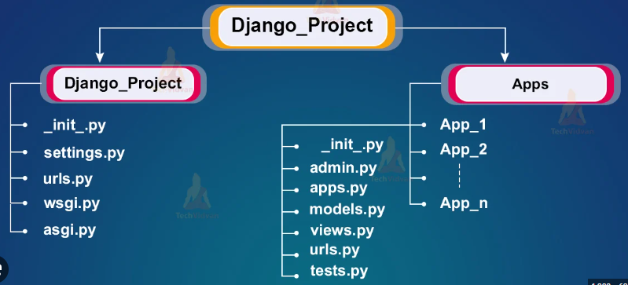

======
Django
======
Django is a free and open-source, Python-based web framework that follows the Model-View-Template (MVT) architectural pattern.

.. tip::
   Django is named after Django Reinhardt, a jazz manouche guitarist from the 1930s to early 1950s.

`Official website <https://www.djangoproject.com/>`_

`Writing your first Django app <https://docs.djangoproject.com/en/5.0/intro/tutorial01/>`_

Control flow in MVT architecture
================================

   
   Django MVT. `Source <https://www.educative.io/answers/what-is-mvt-structure-in-django>`_

#. The user interacts with a Django application using a URL that is passed to the MVT architecture. A URL mapper is used to redirect the requests to the appropriate view based on the request URL.
#. If an appropriate view is found, it will be invoked.
#. The View will interact with the Model and retrieve the necessary data from the database via Model.
#. The View will render an appropriate template along with the retrieved data to the user.

Model
======
A model is the single, definitive source of information about your data. It contains the essential fields and behaviors of the data you’re storing. 
Django follows the **DRY (Don’t repeat yourself) Principle**. The goal is to define your data model in one place and automatically derive things from it.

This includes the migrations - unlike in Ruby On Rails, for example, migrations are entirely derived from your models file, and are essentially a  
history that Django can roll through to update your database schema to match your current models.

View
====
A view is a “type” of web page in your Django application that generally serves a specific function and has a specific template.

For example, in a blog application, you might have the following views:

* Blog homepage - displays the latest few entries.
* Entry “detail” page - permalink page for a single entry.
* Year-based archive page – displays all months with entries in the given year.

A View is a handler function that accepts HTTP requests, processes them, and returns the HTTP response. 
It retrieves the necessary data to fulfill the request using Models and renders them on the user interface using Templates.
It can also create an HTML page using an HTML template dynamically, and populate it with data fetched from the model.

Template
========
A Template is a text file that defines the structure or layout of the user interface. The text file can be any type of file; for example HTML, XML, etc.  
It can accept data from the view and render it using jinja syntax.

   
   Django File Structure. `Source <https://www.tutorialspoint.com/django/django_file_structure.htm>`_

.. tip::
   Django apps are “pluggable”: You can use an app in multiple projects, and you can distribute apps, because they don’t have to be tied to a given Django installation.

   To include the app in our project, we need to add a reference to its configuration class in the INSTALLED_APPS setting

Installation
============

#. Install Python 3.6 or higher (e.g ``sudo apt-get install python3.6`` or on Windows `download <https://www.python.org/downloads/windows/>`_ and install)
#. Install Django (e.g. ``pip install django``)

Django сommands
===============

* ``django-admin startproject <project_name>`` - create a new project
  
* ``python manage.py runserver`` - run the web server (default port is 8000) to acceess it go to ``http://localhost:8000``

* ``py manage.py startapp <app_name>`` - create a new app (app is a part of a project)

* ``py manage.py migrate`` - look at the INSTALLED_APPS setting and create any necessary database tables according to the database settings in your mysite/settings.py  
  file and the database migrations shipped with the app. So it actually modifies your database structure in the database.

* ``py manage.py makemigrations`` - you’re telling Django that you’ve made some changes to your models and that you’d like the changes to be stored as a migration.  
  **Migrations** are how Django stores changes to your models (and thus your database schema) - they’re files on disk (e.g. polls/migrations/0001_initial.py)

* ``py manage.py migrate`` - takes all the migrations that haven’t been applied (Django tracks which ones are applied using a special table in your database 
  called django_migrations) and runs them against your database - essentially, synchronizing the changes you made to your models with the schema in the database.

* ``py manage.py sqlmigrate <app_name> <migration_name>`` - displays the SQL statements for a migration (e.g. ``py manage.py sqlmigrate polls 0001``)  
  The sqlmigrate command doesn’t actually run the migration on your database - instead, it prints it to the screen so that you can see what SQL Django 
  thinks is required. It’s useful for checking what Django is going to do or if you have database administrators who require SQL scripts for changes.

* ``py manage.py check`` - run a system check to inspect the entire Django project for common problems.

* ``py manage.py shell`` - run the Python interactive interpreter, with Django already imported. It allows for executing arbitrary Python code for the purpose of 
  debugging, introspection, or testing Django code.

3 steps to make a model change:
-------------------------------

#. Change your models (in models.py).
#. Run ``py manage.py makemigrations`` to create migrations for those changes
#. Run ``py manage.py migrate`` to apply those changes to the database.

Databse API
===========

`Django Database API <https://docs.djangoproject.com/en/5.0/topics/db/queries/>`_

* ``<ModelName>.objects.all()`` - returns objects from the database (e.g. ``Question.objects.all()``) (``SELECT * FROM Question``)
* ``<ModelName>.objects.get(<field_name>=<value>)`` - returns a single object matching the given keyword arguments (e.g. ``Question.objects.get(id=1)``)
  (``SELECT * FROM Question WHERE id=1``)

Admin site
==========	
Admin site is a built-in app that Django provides for administrative activities. It can be used to create, view, update and delete records.

Creating an admin user

#. Run ``py manage.py createsuperuser`` and enter the username, email and password for the admin user.
#. ``python manage.py runserver`` - start the development server
#. Open in a web browser ``http://localhost:8000/admin`` and enter the username and password to login to the admin site.