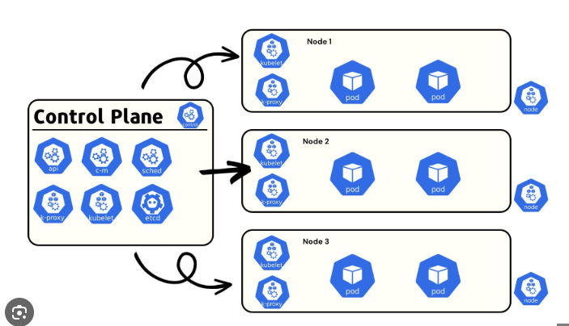

===========
Kubernetes
===========
Kubernetes (K8s) is an open-source container orchestration platform that automates the deployment, scaling, and 
management of containerized applications. It groups containers that make up an application into logical units 
for easy management and discovery. Kubernetes provides a framework to run distributed systems resiliently, 
taking care of scaling and failover for your applications. 

* `Official Documentation <https://kubernetes.io/docs/home/>`_ 

   Kubernetes cluster architecture showing Control Plane (Master Node) components like API Server, etcd, Scheduler, 
   and Controller Manager, along with Data Plane (Worker Nodes) components including kubelet, container runtime, 
   and kube-proxy 