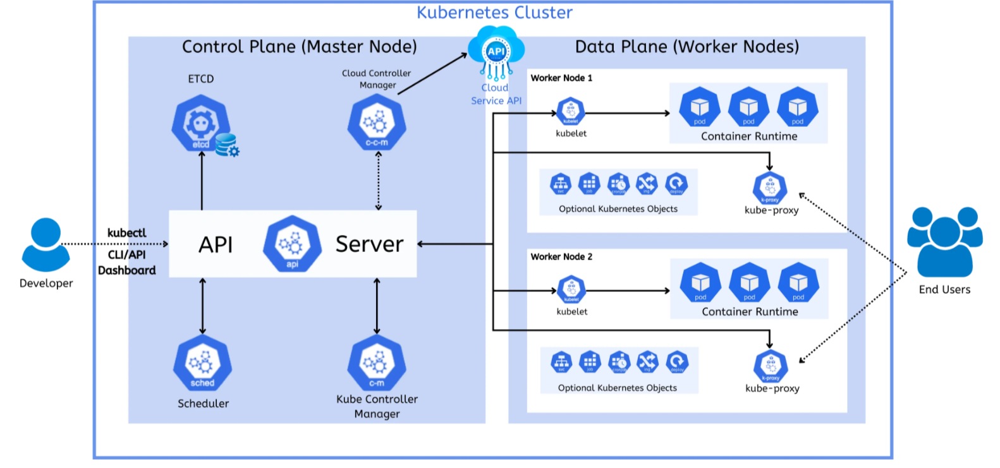

===========
Kubernetes
===========
Kubernetes (K8s) is an open-source container orchestration platform that automates the deployment, scaling, and 
management of containerized applications. It groups containers that make up an application into logical units 
for easy management and discovery. Kubernetes provides a framework to run distributed systems resiliently, 
taking care of scaling and failover for your applications. 

* `Official Documentation <https://kubernetes.io/docs/home/>`_

   Kubernetes cluster architecture

Components and Terminology
==========================

* `Pod <https://kubernetes.io/docs/concepts/workloads/pods/pod-overview/>`_ - a pod is the smallest deployable unit in Kubernetes, 
  and is the basic building block of your application. A pod is a collection of one or more containers, 
  with shared storage and network resources, and a specification for how to run the containers.

* `Namespace <https://kubernetes.io/docs/concepts/overview/working-with-objects/namespaces/>`_ - a namespace is a 
  logical grouping of resources in a cluster

* `Secret <https://kubernetes.io/docs/concepts/configuration/secret/>`_ - a secret is an object that contains sensitive 
  information such as passwords, API keys, and certificates

* `ConfigMap <https://kubernetes.io/docs/concepts/configuration/configmap/>`_ - a configmap is an object that contains configuration 
  information for an application (as key-value pairs)

* `Deployment <https://kubernetes.io/docs/concepts/workloads/controllers/deployment/>`_ - a Deployment manages a set of Pods to run an 
  application workload, usually one that doesn't maintain state

* `Service <https://kubernetes.io/docs/concepts/services-networking/service/>`_ - a service is an object (the same way that a Pod or a 
  ConfigMap is an object). Since Pods are ephemeral (they can be restarted, moved to another node, or replaced), a Service ensures 
  that applications can always reach the right Pods even if their IP addresses change.

Kubectl
=======
Kubectl is a command-line tool for controlling the Kubernetes cluster. It allows you to manage your cluster and 
applications through the Kubernetes API.

* `Kubectl Documentation <https://kubernetes.io/docs/reference/kubectl/>`_ 

.. note::
   Kubernetes config files are stored in the ``.kube`` directory of the user's home directory.

Commands
========

* ``kubectl get nodes`` - list all nodes in the cluster

* ``kubectl create namespace <namespace>`` - create a new namespace (`more info <https://kubernetes.io/docs/reference/kubectl/generated/kubectl_create/>`_)

* ``kubectl get namespace`` - list all namespaces in the cluster 

* ``kubectl apply -n <namespace> -f <filename>`` - apply a configuration to a namespace 
  (*e.g. kubectl apply -n my-namespace -f configmaps/my-configmap.yaml*) (`more info <https://kubernetes.io/docs/reference/kubectl/generated/kubectl_apply/>`_)

