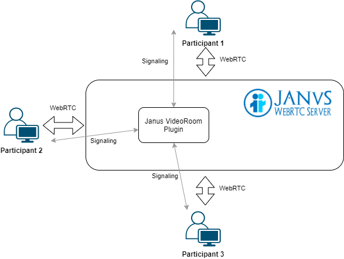

======
WebRTC
======
WebRTC (Web Real-Time Communications) is a free, open project that provides browsers and mobile applications with Real-Time Communications (RTC) capabilities 
via simple APIs.

WebRTC enables peer-to-peer communication for video, audio, and data sharing directly between web browsers without the need 
for any plugins or external software.

The technologies behind WebRTC are implemented as an open web standard and available as regular JavaScript APIs in all major browsers.

`Website <https://webrtc.org/>`_

.. figure:: images/webrtc.png
   :width: 450px
   :alt: How WebRTC works
   
   How WebRTC works. `Source <https://www.techtarget.com/searchunifiedcommunications/definition/WebRTC-Web-Real-Time-Communications>`_.

* Signaling server (e.g. Node.js + Socket.IO) is used to exchange information between peers, such as session control messages, 
  metadata, and media information. 
  WebRTC signaling refers to the process of setting up, controlling, and terminating a communication session.
  It is not part of the WebRTC standard, and developers can use any protocol or technology to implement signaling. 
  The most common signaling protocols are SIP, XMPP, and WebSocket (e.g. using Socket.IO).

* STUN (Session Traversal Utilities for NAT) server helps devices behind NAT devices communicate with other devices across the internet by 
  discovering their public IP address and opening communication channels between them. Google provides a free STUN server at `stun:stun.l.google.com:19302`.

* TURN (Traversal Using Relays around NAT) server is similar to STUN, but it also acts as a relay server for devices that cannot establish a direct 
  peer-to-peer connection due to symmetric NAT or firewall restrictions. Relay server means that all media traffic is relayed through the server,
  which can increase latency. Turn servers are used to route traffic from behind challenging networks.
  Not always needed, but in some corporate environments it might be.

WebRTC communication steps:
---------------------------

1. Get user media: The browser requests permission to access the user's camera and microphone.
2. Create an RTCPeerConnection object: The browser creates an RTCPeerConnection object to manage the connection between peers.
3. Create an offer: The browser creates an offer that includes information about the media tracks, codecs, and other connection parameters.
4. Exchange SDP (Session Description Protocol): The offer is sent to the other peer using the signaling server. 
   The other peer responds with an answer that includes its own media information.
   Offer contains information about the data channels (if needed) that will be used, and how the peer can be reached (ICE candidates).
5. Establish a connection: The peers exchange ICE candidates to establish a direct connection between them.
6. Exchange media: Once the connection is established, the peers can exchange media streams directly without going through a server.

.. note::

   ICE (Interactive Connectivity Establishment) is a framework used to establish a connection between peers by finding the best path for communication.

.. note::

   SDP (Session Description Protocol) is a protocol used to describe media streams and connection parameters between peers.
  

Janus Gateway
=============
Janus is a WebRTC Server conceived as a general purpose WebRTC gateway.
It's purpose is to provide a high-level API to handle WebRTC sessions and to perform media and data processing.

Janus WebRTC Server is needed when your real-time communication requirements go beyond simple point-to-point connections and 
involve scenarios such as multi-protocol support, multi-user conferences, broadcasting, or custom applications. 
Janus has modular architecture, scalability, and support for various communication protocols.

`Official Website <https://janus.conf.meetecho.com/>`_

`GitHub <https://github.com/meetecho/janus-gateway>`_

   
   Janus WebRTC Server Architecture. `Source <https://webrtc.ventures/2020/12/janus-webrtc-media-server-video-conference-app/>`_.