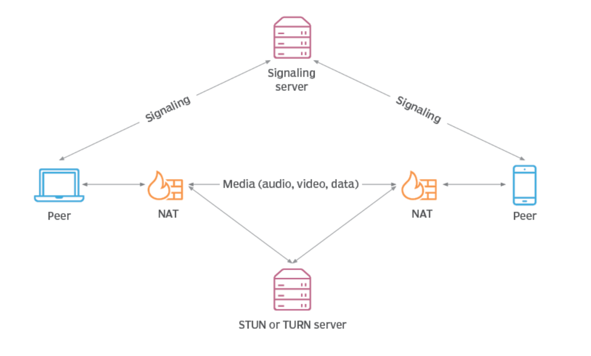

======
WebRTC
======
WebRTC (Web Real-Time Communications) is a free, open project that provides browsers and mobile applications with Real-Time Communications (RTC) capabilities 
via simple APIs.

WebRTC enables peer-to-peer communication for video, audio, and data sharing directly between web browsers without the need 
for any plugins or external software.

The technologies behind WebRTC are implemented as an open web standard and available as regular JavaScript APIs in all major browsers.

`Website <https://webrtc.org/>`_

   
   How WebRTC works. `Source <https://www.techtarget.com/searchunifiedcommunications/definition/WebRTC-Web-Real-Time-Communications>`_.

Janus Gateway
=============
Janus is a WebRTC Server developed by Meetecho conceived as a general purpose WebRTC gateway.
It's purpose is to provide a high-level API to handle WebRTC sessions and to perform media and data processing.

`GitHub <https://github.com/meetecho/janus-gateway>`_