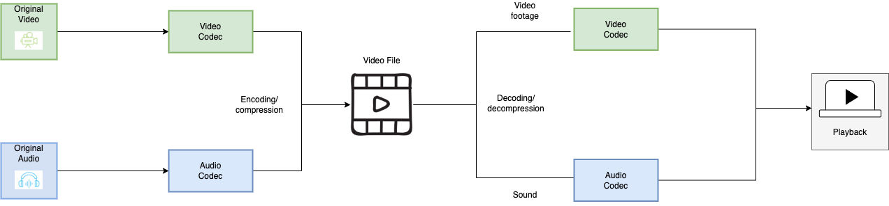

======================
Computer Vision in ROS
======================

Video encoding and decoding
============================
Video encoding is the process of compressing and potentially changing the format of video content, sometimes even 
changing an analog source to a digital one. In regards to compression, the goal is so that it consumes less space. 
This is because it's a lossy process that throws away information related to the video

Decoding is essentially the reverse of encoding. A decoder takes an encoded, compressed stream/file and decompresses it back into its raw form. 
Raw video data is required for editing processes and for viewing of the raw video.

   Video Encoding and Decoding. `Source <https://imagekit.io/blog/video-encoding/>`_

ROS 2 image transport for FFmpeg encoding
=========================================
This ROS 2 image transport supports encoding/decoding with the FFMpeg library. With this transport you can encode h264 and h265, 
using Nvidia hardware acceleration when available.

`GitHub <https://github.com/ros-misc-utilities/ffmpeg_image_transport>`_

image_common (contains image_transport)
=======================================

`GitHub <https://github.com/ros-perception/image_common>`_

cv_bridge
=========
cv_bridge is a ROS package that provides an interface between ROS and OpenCV. It is used to convert between ROS images and OpenCV images.

`GitHub <https://github.com/ros-perception/vision_opencv>`_

OpenCV
======
OpenCV (Open Source Computer Vision Library) is an open source computer vision and machine learning software library.
It is used as a library for real-time computer vision. It is written in C++ and its primary interface is in C++, but it still has a
full C API. There are bindings in Python, Java and MATLAB/Octave. 

OpenCV is used for a wide range of applications, including
medical image analysis, stitching street view images, surveillance video, detecting and recognizing faces, tracking moving objects,
extracting 3D models, and much more.

`Official Website <https://opencv.org/>`_

Cameras
=======
:ref:`Cameras <intel_realsense>`

