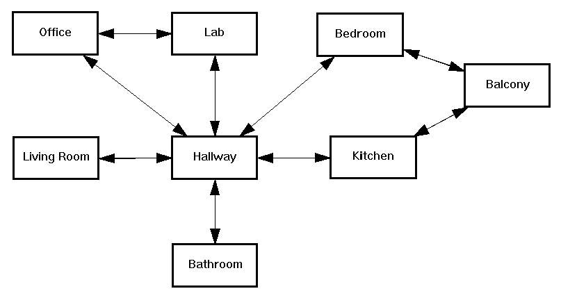

.. _mapping:

=======
Mapping
=======
Mapping, in the context of robotics and ROS (Robot Operating System), refers to the process of creating a representation of 
the environment that a robot or sensor can perceive. The goal of mapping is to generate a map, which is typically a 
2D or 3D representation, that captures the spatial layout, obstacles, and other relevant features of the surroundings. 
[`Source <https://medium.com/@mansooralam129047/what-is-mapping-in-robotics-how-to-create-map-in-ros-8c002d409c07>`_]

Robotic mapping is a discipline related to computer vision and cartography. The goal for an autonomous robot is to be able 
to construct (or use) a map (outdoor use) or floor plan (indoor use) and to localize itself and its recharging bases or beacons 
in it. [`Source <https://en.wikipedia.org/wiki/Robotic_mapping>`_]

Map representation
==================
The internal representation of the map can be "metric" or "topological"

* The metric framework is the most common for humans and considers a two-dimensional space in which it places the objects. 
  The objects are placed with precise coordinates. This representation is very useful, but is sensitive to noise and it is 
  difficult to calculate the distances precisely.

* The topological framework only considers places and relations between them. Often, the distances between places are stored. 
  The map is then a graph, in which the nodes corresponds to places and arcs correspond to the paths.
  
Many techniques use probabilistic representations of the map, in order to handle uncertainty.

There are three main methods of map representations, i.e., free space maps (occupancy grids), object maps, and composite maps. 
These employ the notion of a grid, but permit the resolution of the grid to vary so that it can become finer 
where more accuracy is needed and more coarse where the map is uniform.

Occupancy Grid Map (metric map)
===============================
Discrete map is like a grid, where the environment is divided into cells. Each cell represents a specific area, and the map is essentially  
a collection of these cells, each with some attribute (like occupancy probability in a slam scenario).  
It's like mapping the world with a bunch of tiny squares or hexagons. 
This makes it computationally more tractable, especially for grid-based algorithms.

.. figure:: images/occupancy_grid_map.png
   :width: 450px
   :alt: Occupancy Grid Map
   
   Occupancy Grid Map

OctoMap (metric map)
====================
The OctoMap library implements a 3D occupancy grid mapping approach, providing data structures and 
mapping algorithms in C++ particularly suited for robotics. The map implementation is based on an octree.

`Official Website <https://octomap.github.io/>`_

OctoMap vs 3D Occupancy Grid (Voxel Grid)
-----------------------------------------
1. Structure: Octomap uses an octree data structure, while voxel grids use a regular 3D grid.
2. Resolution: Octomap can adapt its resolution based on sensor data, while voxel grids have a fixed resolution.
3. Memory usage: Octomap can be more memory-efficient than voxel grids, especially for sparse environments, due to its hierarchical structure.
4. Querying: Octomap allows for efficient querying of the map at different resolutions, while voxel grids provide direct access to individual voxels.

Semantic Map (metric map)
=========================
Semantic map is a type of map that includes information about the meaning or semantics of the environment.
For example, a semantic map might include information about the function of different areas in a building,
such as "kitchen," "living room," or "bathroom." This type of map can be useful for robots that need to perform
specific tasks in different areas, such as cleaning or delivering items.

Topological Maps
================
Topological maps focus on the spatial relationships and connectivity between different locations, emphasizing the relative positions 
of features rather than their precise geographic coordinates. These maps are often used in navigation systems  and robotics to plan  
efficient routes and understand the layout of an area. They're handy when you care more about the connections between places  
than the exact distances. 

.. tip::
   Origin of word "topology": Greek topos (place) + logos (study).*

   
   Topological Map

Topometric Map
==============
Topometric maps are a combination of topological and metric maps, providing both spatial relationships and precise coordinates.

Semantic Topometric Map
=======================
Semantic topometric maps combine the spatial relationships of topological maps with the semantic information of semantic maps,
providing a comprehensive representation of the environment that includes both the layout and the meaning of different areas.

ROS Packages and Interfaces
===========================

* **depthimage_to_laserscan** - converts depth image to laser scan  
  `GitHub <https://github.com/ros-perception/depthimage_to_laserscan/tree/ros2>`_

* **nav2_map_server** - the Map Server provides maps to the rest of the Nav2 system using both topic and service interfaces.  
  Map server will expose maps on the node bringup, but can also change maps using a load_map service during run-time,   
  as well as save maps using a save_map server. `GitHub <https://github.com/ros-planning/navigation2/tree/main/nav2_map_server>`_

* `nav_msgs/OccupancyGrid <https://docs.ros.org/en/melodic/api/nav_msgs/html/msg/OccupancyGrid.html>`_ - represents a 2-D grid map, in which each cell represents 
  the probability of occupancy

   