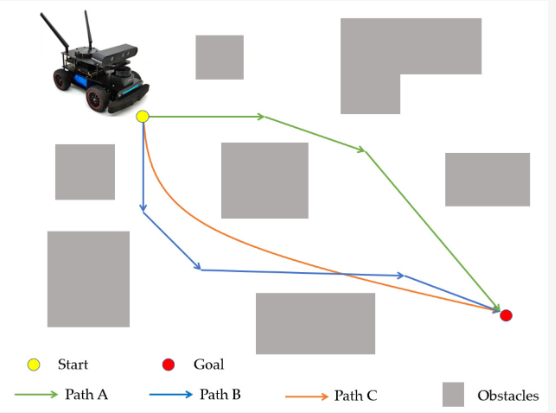

=============
Path planning 
=============
Path planning is the process of finding a path from a start point to a goal point through obstacles. 

.. image:: ../images/set_goal_for_nav.gif
   :width: 400
   :alt: Setting a goal for navigation

Global planning
===============

Local planning
==============

ROS 2 Packages and Messages
=========================

* `nav2_bt_navigator <https://github.com/ros-planning/navigation2/tree/main/nav2_bt_navigator>`__ (replaces move_base)
  The BT Navigator receives a goal pose and navigates the robot to the specified destination(s). To do so,  
  the module reads an XML description of the Behavior Tree from a file, as specified by a Node parameter, and passes that to a generic  
  BehaviorTreeEngine class which uses the Behavior-Tree.CPP library to dynamically create and execute the BT. The BT XML can also be  
  specified on a per-task basis so that your robot may have many different types of navigation or autonomy behaviors on a per-task basis  

ROS 1
-----

* **move_base** 
  provides an implementation of an action (see the actionlib package) that, given a goal in the world, will attempt to reach it with  
  a mobile base. The move_base node links together a global and local planner to accomplish its global navigation task.  