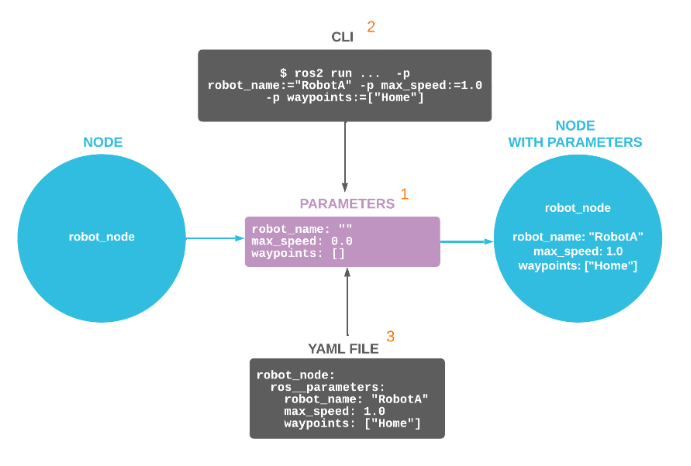

==========
Parameters
==========
Parameters in ROS 2 are associated with individual nodes. Parameters are used to configure nodes at startup (and during runtime), 
without changing the code. The lifetime of a parameter is tied to the lifetime of the node (though the node could implement some sort 
of persistence to reload values after restart).

`ROS 2 Documentation <https://docs.ros.org/en/rolling/Concepts/Basic/About-Parameters.html>`_

How to Use ROS 2 Parameters
===========================

ROS 2 nodes first declare the parameters they can accept (1), then read the parameter values passed to them during 
startup – via the command line interface (2) or a YAML configuration file (3) – to determine their behavior. 
Parameters can be integers, floating point numbers, booleans, string, or arrays of the previous types

   
   ROS 2 Parameters. `Source <https://foxglove.dev/blog/how-to-use-ros2-parameters>`_.