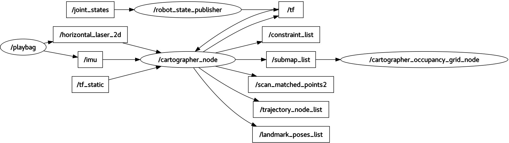

=========
ROS graph
=========
ROS graph is a **graph representation of all processes involved in the robot and the communication among them**.  
ROS graph is a directed bipartite graph (a.k.a. bigraph), meaning that there are two disjoint sets of vertices  
in the graph: ROS nodes, and ROS topics.  

ROS **nodes abstract hardware components** such as sensors, actuators, controllers, processors, etc., that run ROS-based processes.  

ROS **topics are the information communicated** by the ROS nodes.  

A ROS node can publish to a topic (when the node is the source of the data) or subscribe to it (when the node is the destination of the data).  

The edges of the ROS graph represent the publish and subscribe actions.  

