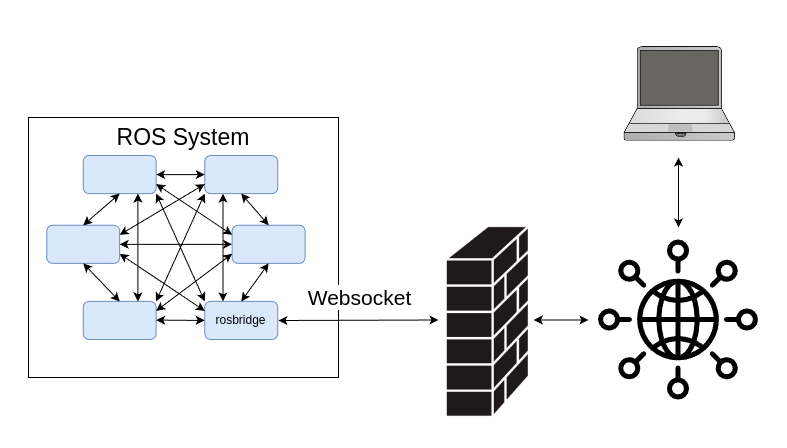
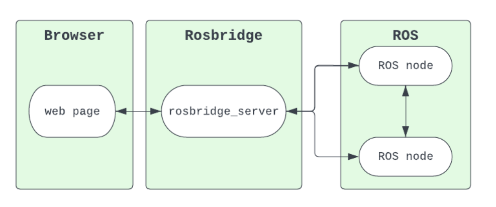

===============
Robot Web Tools
===============
Robot Web Tools is a set of tools for working with ROS in a web browser. It provides a set of tools for working with ROS from a web browser. 
It includes a JavaScript library for creating web-based user interfaces, a WebSocket interface to ROS, and a suite of 
web-based tools for working with ROS.

`Website <https://robotwebtools.github.io/>`_

Rosbridge
=========
Rosbridge is a :ref:`WebSocket <websocket>` interface to ROS functionality for non-ROS programs. 

The message transport of rosbridge is JSON objects.

`GitHub <https://github.com/RobotWebTools/rosbridge_suite>`_

   
   ROS and WebSocket. `Source <https://picknik.ai/robotics/systems%20engineering/software%20system/moveit/trigger%20objective/network%20messages/json/rosbridge/roswebtools/python/rust/java/ports/factory%20controller/custom%20ui/ros/multi-robot/interoperability/fleet%20management/end-user/ui/python%20hardware/microserves/dds/tcpros/webapp/docker/ros2/2024/01/30/Systems-Engineering-Your-Robotics-Project.html>`_

   
Rosbridge. `Source <https://foxglove.dev/blog/using-rosbridge-with-ros2>`_.

* **rosbridge_server** is a server which accepts websockets connections and implements the rosbridge protocol.

Installation and Usage
----------------------

* ``sudo apt-get install ros-<distro>-rosbridge-server`` (packages installed: rosbridge_server, rosbridge_library, rosbridge_msgs, rosapi)
* ``ros2 launch rosbridge_server rosbridge_websocket_launch.xml`` - launch the Rosbridge WebSocket server (default port: 9090)

Tutorial: `Using rosbridge with ROS2 <https://foxglove.dev/blog/using-rosbridge-with-ros2>`_

Foxglove
========
`Foxglove Studio <https://foxglove.dev/studio>`_ is an open source visualization and debugging tool for your robotics data.

It can be run as a standalone desktop app, accessed via your browser, or even self-hosted on your own domain.

ROS Foxglove bridge
-------------------
The ``foxglove_bridge`` uses the Foxglove WebSocket protocol, a similar protocol to rosbridge, but with the ability to support additional 
schema formats such as ROS 2 .msg and ROS 2 .idl, parameters, graph introspection, and non-ROS systems. The bridge is written in C++ and 
designed for high performance with low overhead to minimize the impact to your robot stack

`GitHub <https://github.com/foxglove/ros-foxglove-bridge>`_

roslibjs (ROS JavaScript Library)
=================================
roslibjs is a JavaScript library for interacting with ROS from the browser.
It uses **WebSockets** to connect with rosbridge and provides publishing, subscribing, service calls, actionlib, 
TF, URDF parsing, and other essential ROS functionality. It communicates with rosbridge using **JSON messages**.
roslibjs is developed as part of the Robot Web Tools effort.

`GitHub <https://github.com/RobotWebTools/roslibjs>`_

